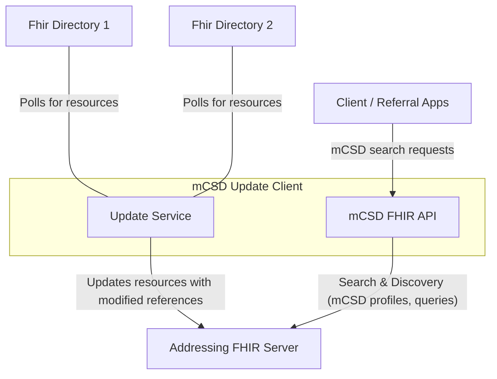
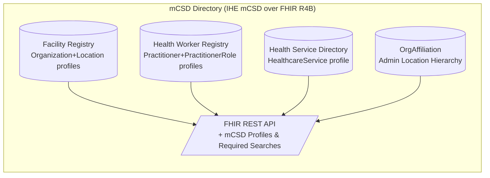

# MCSD Update client

The MCSD update client allows you update FHIR resources conforming to the [mCSD specification](https://profiles.ihe.net/ITI/mCSD/volume-1.html#1-46-mobile-care-services-discovery-mcsd). This application is an implementation of [ITI-91](https://profiles.ihe.net/ITI/mCSD/ITI-91.html).

Data from target FHIR directories is taken by continuously polling for mCSD resources, convert their references to point to the addressing FHIR server before updating the resources on that server.




## Update service
The Update service is responsible for polling from one or more FHIR directories for new or updated resources. It does so by comparing data against the addressing FHIR Directory and make decisions based on the outcome of the comparison. When an update is found, it modifies any internal id and references by namespacing them according to the id of the server it is polling data from. This is essential to avoid id collisions and so that references point to the addressing FHIR server before updating the resource on that server.

For instance, take the following Organization resource found in a directory:

```json
{
  "resourceType": "Organization",
  "id": "1",
  "name": "Good Health Clinic",
  "partOf": {
    "reference": "Organization/2"
  }
}
```

In this case, the reference of "partOf" points to another Organization resource within that directory. When this resource is updated to the addressing FHIR server, the reference will be modified to point to the addressing FHIR server instead:

```json
{
  "resourceType": "Organization",
  "id": "1",
  "name": "Good Health Clinic",
  "partOf": {
    "reference": "http://addressing-fhir-server/Organization/random-identifier-2"
  }
}
```

This allows for a consistent and unified view of resources across multiple directories, ensuring that all references are correctly resolved to the addressing FHIR server.

The random identifier added to the identifier is generated to avoid conflicts with existing resource IDs on the addressing server since multiple directories may have resources with the same ID.


### Polling for update

The update service a polling mechanism to periodically check one or more FHIR directories for new or updated resources. When a resource is detected, the client retrieves it, modifies any internal references to point to the addressing FHIR server, and then updates the resource on that server. This is done through the scheduler component, which triggers the polling process at regular intervals.

It will take care of only fetching resources that have been created or updated since the last successful poll, using the `_lastUpdated` search parameter. This ensures that the update process is efficient and only processes new or changed data.


## mCSD FHIR API 

The system exposes a FHIR API that adheres to the mCSD specification, allowing clients to perform CRUD operations on supported resources. The API supports standard HTTP methods such as GET, POST, PUT, and DELETE, and returns responses in JSON format.

In a nutshell, mCSD is a standardized way to represent and exchange information about healthcare facilities, services, and providers using FHIR resources. It defines specific profiles and search parameters to ensure interoperability between different systems.





